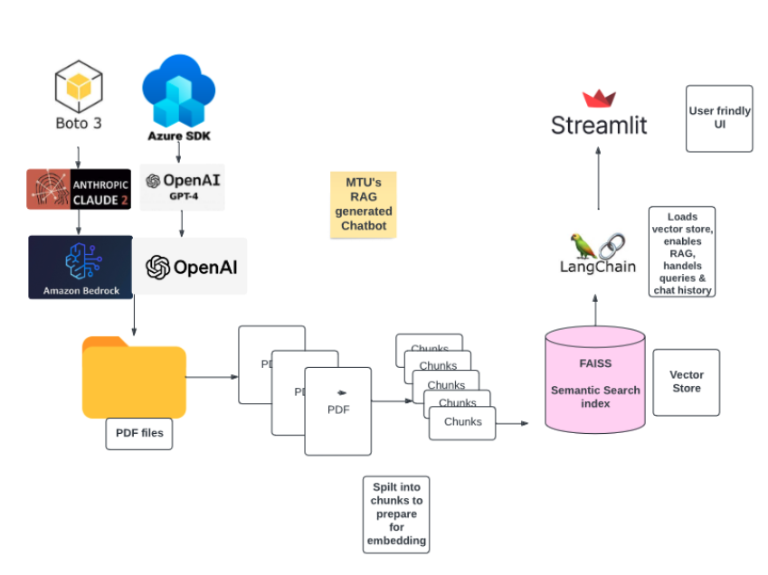

# mtu_chatbot
# MTU Chatbot

## Overview
The MTU Chatbot, developed at Munster Technological University (MTU), utilizes cutting-edge language models including Anthropic’s Claude 2 and OpenAI’s GPT-4, both hosted on AWS Bedrock API and OpenAI API, respectively. This advanced conversational AI tool interacts through a user-friendly interface to provide MTU postgraduate students with tailored recommendations and detailed information about postgraduate courses. Leveraging exclusive, proprietary data—including fictitious, unsafe courses and simulated course reviews—the chatbot enhances decision-making support through robust NLP and retrieval-augmented generation (RAG) techniques.

A comprehensive comparative analysis using the Langsmith tool assesses these large language models (LLMs) on performance, accuracy, bias, safety, cost, latency, and adaptability. This evaluation plays a crucial role in refining the chatbot’s capabilities, ensuring it aligns with the highest standards of ethical AI practices while effectively supporting students in their educational endeavors.


## MTU Chatbot Architecture and Design
### Tools and Technologies
- **Python SDK**
- **Data Collection and Cleaning**
- **LLM Models:** Claude 2 and GPT-4
- **Embedding Models:**
  - Titan Text Embedding for Claude chatbot
  - Text Embedding Ada V2 for OpenAI chatbot
- **Prompt Templates:** Prompt, Memory templates
- **FAISS (Facebook AI Similarity Search) by Meta**
- **Langchain**
- **Streamlit**





## Installation
### Requirements
-Ensure you have a virtual environment set up for the project to manage dependencies:
```bash
python -m venv mtu-env
mtu-env\Scripts\activate

Install required packages:

pip install -r requirements.txt


##Running the Application

#Navigate to chatbot\app.py and run the Streamlit UI:
python3 -m streamlit run chatbot/app.py
```
## User Interface
### Streamlit UI
-The Streamlit UI allows users to choose between GPT-4 or Claude 2 for generating responses and provides an interactive session through user input.

## Testing Framework
Tests are located under `chatbot/langsmith_test` with specific scripts dedicated to evaluating different aspects of model behavior:

### File Structure:


### Accuracy and Bias Tests
- `claude_accuracy_cot_test.py`: Contextual accuracy using chain of thought (COT) for Claude 2.
- `gender_bias_claude.py`: Gender bias evaluation for Claude 2.
- `gender_bias_gpt.py`: Gender bias evaluation for GPT-4.
- `gpt_accuracy_cot_test.py`: Contextual accuracy for GPT-4.
- `claude_bias_culture.py`, `gpt_bias_culture.py`: Cultural bias tests for both models.

### Safety Tests
- `safetybench_claude.py`: Safety testing for Claude 2.
- `safetybench_gpt.py`: Safety testing for GPT-4.

## Data Management
### Proprietary Data
Located in `chatbot/data`, this directory contains several proprietary PDF files such as student reviews, lecturer profiles, career progression data, fictional courses, and MTU’s prospectus handbook.

## Folder Structure
Key directories include:
- `chatbot/app.py`: Main application file for the Streamlit UI.
- `chatbot/test`: Used for processing proprietary files.
- `chatbot/langsmith_test`: Contains scripts for testing various model aspects.


## Contribution
Contributions to the MTU Chatbot are welcome. Please ensure to follow the existing code style and add unit tests for any new or changed functionality.
